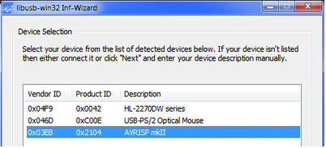
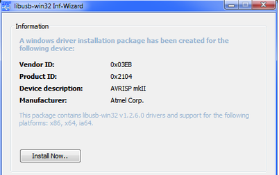

# Installation Pilote
Télécharger et dézipper le pilote [libusb-win32](http://sourceforge.net/projects/libusb-win32/files/libusb-win32-releases/). 

Faire un clic droit sur le fichier \libusb-win32\libusb-win32-bin-1.2.6.0\bin\inf-wizard.exe et sélectionner **Exécuter en tant qu'administrateur**.  

Dans la liste de matériel, sélectionner **AVRISP mkII**. 

Valider jusqu'à atteindre la page **Information**. Cliquer sur le bouton **Install now...**.  

