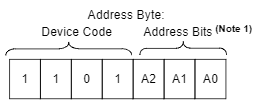
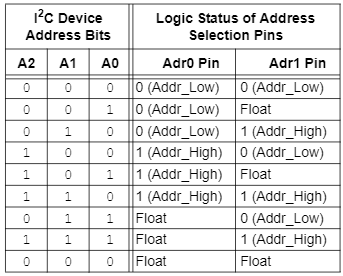
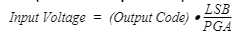

# [](#header-1)I2C
Installer i2c-tools : 
```
sudo apt install i2c-tools
```

Pour détecter les périphériques I2C, éxécuter : 
```
i2cdetect -y 1
```

# [](#header-1)Périphériques
Au démarrage de la Raspberry Pi, il est nécessaire de configurer les différents capteurs et actionneurs en fonction de nos besoins.  
Le script [gpioConfig.sh](https://github.com/SNDCECOCLIM/sndc-config/blob/master/home/pi/sndc/gpioConfig.sh) permet de configurer l'ensemble des entrées et sorties de la carte de commande 470H43.  
Le service [gpioConfig.service](https://github.com/SNDCECOCLIM/sndc-config/blob/master/debian/gpioConfig.service) permet d'éxécuter le script [gpioConfig.sh](https://github.com/SNDCECOCLIM/sndc-config/blob/master/home/pi/sndc/gpioConfig.sh) automatiquement au démarrage de la Raspberry Pi.  
**Astuce :** _Si le service est modifié, ne pas oublier de recharger les services avec la commande :_  
```bash
sudo systemctl daemon-reload
```

## [](#header-2)Horloge
L'horloge utiliséee est une [DS3232](../../Datasheets/DS3232.pdf).
Son adresse est 1101000 soit 0x68. Elle ne peut pas être modifiée.  
Pour configurer l'horloge au démarrage, la commande utilisée est : 
```bash
echo ds3232 0x68 > /sys/class/i2c-adapter/i2c-1/new_device
```

## [](#header-2)Balances et Capteurs de pression
Le composant permettant de lire les capteurs de pression est un ADC [MCP3423](../../Datasheets/MCP342x.pdf).  
Il possède 2 voies permettant de lire les valeurs du capteur de pression bouteille et nourrice.   
Pour les balances, il s'agit d'un ADC [MCP3424](../../Datasheets/MCP342x.pdf).  
Il possède 4 voies permettant de lire les valeurs de la balance bouteille et des 3 pesons d'huile.  
L'adresse sur le bus I2C de ces deux composants est définie par les pins Adr0 (9) et Adr1 (10).  
    
L'adresse pour les capteurs de pression est 0x6b (1101011).  
L'adresse pour les balances est 0x69 (1101001).  
Pour activer l'ADC au démarrage, il faut exécuter la commande suivante : 
```bash
echo mcp3424 0x69 >/sys/bus/i2c/devices/i2c-1/new_device
echo mcp3423 0x6b >/sys/bus/i2c/devices/i2c-1/new_device
```
La fréquence d'échantillonage de ces ADC peut être programmée. La précision de la mesure varie en fonction de cette fréquence. Le LSB (facteur de conversion) en dépend également.  
La fréquence peut prendre les valeurs suivantes : 

| Fréquence | Précision | LSB       |
|:---------:|:---------:|:---------:|
| 3.75 SPS  | 18 bits   | 15.625 µV |
| 15 SPS    | 16 bits   | 62.5 µV   |
| 60 SPS    | 14 bits   | 250 µV    |
| 240 SPS   | 12 bits   | 1 mV      |

Pour régler ce paramètre, il faut éxécuter les commandes suivantes : 
```bash
echo 15 > /sys/bus/i2c/devices/1-0069/iio\:device0/in_voltage_sampling_frequency
echo 15 > /sys/bus/i2c/devices/1-006b/iio\:device1/in_voltage_sampling_frequency
```
Ici la fréquence d'échantillonage est de 15 valeurs par secondes, la précision sera donc de 16 bits et le LSB sera 62.5 µV.  
Pour calculer la tension mesurée, il faut appliquer la formule suivante (le gain PGA est égal à 1):  


Le gain est réglé avec la valeur in_voltage_scale (égale à LSB/PGA).  

## [](#header-2)Capteur de température (Pas utilisé)
Le composant permettant de mesurer la température est un [LM75](../../Datasheets/lm75.pdf).  
Son adresse sur le bus I2C est défini par les pins A2(5), A1(6) et A0(7).  
Son adresse est 0x48 (1001000). 

Pour activer le capteur de température, il faut éxécuter la ligne suivante au démarrage de la Raspberry Pi :  
```bash
echo lm75 0x48 >/sys/bus/i2c/devices/i2c-1/new_device
```
Pour lire la température en millidegrés, exécuter : 
```bash
echo mcp3424 0x69 >/sys/bus/i2c/devices/i2c-1/new_device
cat /sys/class/hwmon/hwmon3/temp1_input
```
Pour info la valeur de température de hwmon0 correspond à la température du CPU de la Raspberry Pi.  
La température de hwmon2 correspond à la température de l'horloge DS3232 (+/- 3°C, rafraichie toutes les 64s).  


## [](#header-2) GPIOs : Relais, Buzzer, Ventilateur et Pressostat 
[Pinout Raspberry Pi](https://fr.pinout.xyz/)
  
|     Sortie        | GPIO Dec  | GPIO Hexa    |     PIN Raspberry     |     Etat défaut    |
|:-----------------:|:---------:|:------------:|:---------------------:|:------------------:|
|     Relais 1      |     11    |     0x00B    |     23                |     0              |
|     Relais 2      |     7     |     0x007    |     26                |     0              |
|     Relais 3      |     5     |     0x005    |     29                |     0              |
|     Relais 4      |     12    |     0x00C    |     32                |     0              |
|     Relais 5      |     6     |     0x006    |     31                |     0              |
|     Relais 6      |     13    |     0x00D    |     33                |     0              |
|     Relais 7      |     19    |     0x013    |     35                |     0              |
|     Relais 8      |     26    |     0x01A    |     37                |     0              |
|     Relais 9      |     4     |     0x004    |     7                 |     0              |
|     Relais 10     |     17    |     0x011    |     11                |     0              |
|     Relais 11     |     27    |     0x01B    |     13                |     0              |
|     Relais 12     |     23    |     0x017    |     16                |     0              |
|     Relais 13     |     22    |     0x016    |     15                |     0              |
|     Relais 14     |     24    |     0x018    |     18                |     0              |
|     Buzzer        |     16    |     0x010    |     36                |     0              |
|     Enable        |     8     |     0x008    |     24                |     0              |

|     Entrée        | GPIO Dec  | GPIO Hexa    |     PIN Raspberry     |     Etat défaut    |
|:-----------------:|:---------:|:------------:|:---------------------:|:------------------:|
|     Pressostat    |     20    |     0x014    |     38                |     1              |
|     Ventilateur   |     21    |     0x015    |     40                |     1              |

