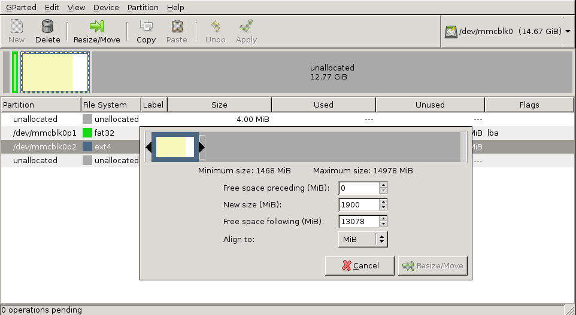

# [](#header-1)Préparer la carte SD en réactivant l'auto expanding
Se connecter en SSH pour effectuer les actions ci-dessous. 
## [](#header-2)Redimensionner la partition
Editer le fichier /boot/cmdline.txt en ajoutant à la fin de la ligne le texte suivant :  
**init=/usr/lib/raspi-config/init_resize.sh**  

Par exemple, le contenu du fichier est initialement : 
```
dwc_otg.lpm_enable=0 console=serial0,115200 console=tty1 root=PARTUUID=1ba1cea3-02 rootfstype=ext4 elevator=deadline fsck.repair=yes rootwait logo.nologo net.ifnames=0

```
et devient donc : 
```
dwc_otg.lpm_enable=0 console=serial0,115200 console=tty1 root=PARTUUID=1ba1cea3-02 rootfstype=ext4 elevator=deadline fsck.repair=yes rootwait logo.nologo net.ifnames=0 init=/usr/lib/raspi-config/init_resize.sh

```
**Attention, le fichier ne doit contenir qu'une ligne, bien vérifier qu'il n'y a pas de retour à la ligne en fin de fichier.**  
## [](#header-2)Redimensionner le système de fichiers 
Récupérer le script **resize2fs_once** et l'activer pour le prochain démarrage : 
```bash
sudo wget -O /etc/init.d/resize2fs_once https://github.com/RPi-Distro/pi-gen/raw/dev/stage2/01-sys-tweaks/files/resize2fs_once
sudo chmod +x /etc/init.d/resize2fs_once
sudo systemctl enable resize2fs_once
```
Ce script va étendre le système de fichier lors du premier démarrage de la carte SD. 

# [](#header-1)Compresser la carte SD
## [](#header-2)Monter la carte SD sur un système Linux
Eteindre la Raspberry Pi et récupérer la carte SD.  
Insérer la carte SD dans un lecteur de carte SD sur une machine Linux.  
Vérifier le nom de la carte SD avec **dmesg**.  
```bash
dmesg
...
[1314286.573659] mmc0: new ultra high speed SDR50 SDHC card at address 59b4
[1314286.574319] mmcblk0: mmc0:59b4 USDU1 14.7 GiB 
[1314286.575783] mmcblk0: p1 p2
 ```
 Ici le nom de la carte SD est mmcblk0.  
## [](#header-2)Réduire la taille de la partition
Lancer GParted.  
Redimensionner la partition avec les curseurs, valider en appuyant sur Resize/Move. Laisser environ 200 MiB de libre pour laisser de la place disponible pour les programmes au démarrage. 

Fermer GParted.
## [](#header-2)Optimiser la compression
Pour optimiser la compression, il faut remplir l'espace libre avec des zéros. (Le remplissage avec des zéros rend la compression plus facile et efficace).   
Pour cela, il faut monter la carte SD sur le système Linux : 
```bash 
mkdir /tmp/sd_root
sudo mount /dev/mmcblk0p2 /tmp/sd_root
```
Remplacer mmcblk0p2 par le nom de la partition suivi de p2 (Correspond à la partition _rootfs_ de Raspbian, p1 étant la partition _boot_)


 [Source](https://blog.dhampir.no/content/shrinking-a-raspbian-installation-and-re-enabling-auto-expanding-for-distribution-of-customized-images).